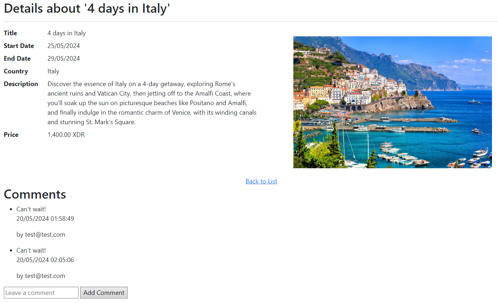
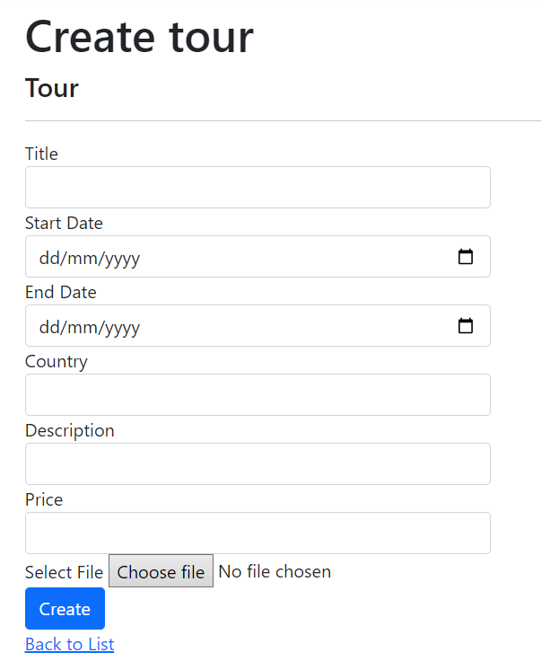
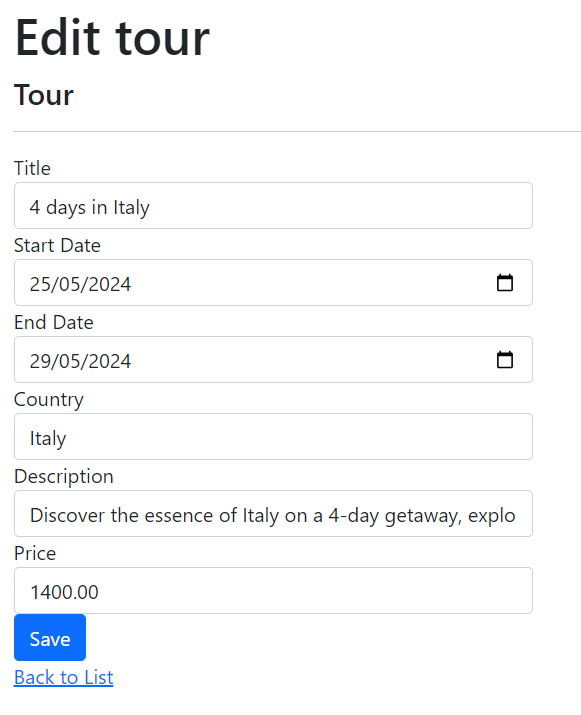
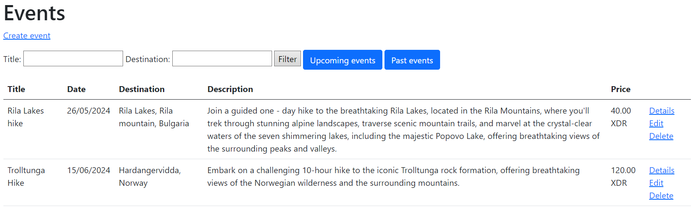

# Tour Agency App website

Direct links:
- [Project description](#project-description)  
- [Pages on the website](#pages)  
- [Permissions to view pages](#permissions-to-view-pages)  
- [Database](#database)  
- [External Resources](#external-resources)  

---

## Project description

The website is for a tour agency that offers guided tours and events to users. The website allows users to browse and book tours or events, and view detailed information about each tour or event, including its title, description, price, and dates. 
Users can also leave comments and reviews about the tours. Additionally, users can create bookings for the tours or events they're interested in, and the website will manage the booking process and store relevant information such as booking dates and user IDs.

## Pages

### Navigation bar

The navigation bar is available on all pages. The below screenshot is the navigation bar which is shown to users who are not authenticated. 
 

In the below screenshot, the logged in user has permission to view all the pages on the website. 
You can see the company name, available pages and on the right- the email of the user which is logged in. 
 

### Homepage

This is the home page of the website. Here you can read some more information about our history and practice. 
 

### Login

If you click on the Log in button from the Navigation bar, this is the page that will open. You are prompted to login using your email and password. 
 

### Register

If you do not have a registration you can create one on this page.
You are prompted to enter your email, type in a password and repeat it. 
Currently, you can only register as a Member. 
 
After clicking on the 'Register' button you will see a message that the registration was confirmed, however you still need to confirm your email address by clicking on the underlined 'Click here to confirm your account' 
 
After confirming your account you will see a message with 'Thank you for confirming your email. 
 

You can also confirm your email adress later in your Profile.

### Profile

When you have logged in, your email will appear on the right corner in the navigation bar. When clicking on it you will be redirected to a page where you can manage your account. 
 
Here you can only do the following:
- Add a phone number
- Change your email address
- Change your password

- If you click on the "Logout" button, you will be logged out and redirected to the Home page. 

### Contacts

The Contact page provides a convenient way to get in touch with us, featuring essential contact information such as our address, phone number, and email address. You can also connect with us on our social media channels, including Facebook, Twitter, and Instagram, to stay updated on our latest news and promotions. Additionally, you can find our location using Google Maps, making it easy to plan a visit or drop by in person. 
 

### Privacy

Our Privacy Policy page outlines the ways in which we collect, use, and protect your personal data, including the information you provide to us when booking a tour or registering for a newsletter. We take your privacy seriously and are committed to transparency and compliance with all relevant data protection regulations. 
 

### Tours

As a guest, if you open the Tours page you will only be able to see details about the Tours we offer and sort by:
- Title
- Country
- Upcoming tours
- Past tours

If you have an account and are logged in you will also be able to sign up for a tour:
 

If you want to sign up for a specific tour, after clicking "Sign Up" the following page will be shown:
 

If you accidentaly try to sign up twice for a tour, the following message will be shown:
 

When you click on Details for a chosen tour the following page will load:
 

Users can also leave comments for a tour. 

If you are an admin, you will be able to see options for Creating a tour and editing or deleting a specific tour
 

A tour has the following attributes:
- Title
- Start Date
- End Date
- Country
- Description
- Price
- Image

-Creating a tour: 
 

-Editing a tour: 
 

-Deleting a tour: 
 

### Events

As a guest, if you open the Events page you will only be able to see details about the Events we offer and sort by:
- Title
- Destination
- Upcoming events
- Past events

If you have an account and are logged in you will also be able to sign up for a event:
 

If you want to sign up for a specific event, after clicking "Sign Up" the following page will be shown:
 

If you accidentaly try to sign up twice for a event, the following message will be shown:
 

When you click on Details for a chosen event the following page will load:
 

If you are an admin, you will be able to see options for Creating a event and editing or deleting a specific event
 

A event has the following attributes:
- Title
- Event Date
- Destination
- Description
- Price
- Image

-Creating a event: 
 

-Editing a event: 
 

-Deleting a event: 
 

### Booked Tours
- This page can only be accessed by authenticated users. In the page you have an option to filter the results - either show past or upcoming tours. By default all will be shown.

As a member, when you open the Booked Tours page, you can view the tours which you have signed up for. 
 

If you choose to withdraw from a tour, you can do so by clicking on the "Drop out" link. You will be prompted to confirm:
 

As an administartor, when you open the Booked Tours page, you can view all the bookigs for tours which people have signed up for. 
 

### Booked Events
- This page can only be accessed by authenticated users. In the page you have an option to filter the results - either show past or upcoming events. By default all will be shown.

As a member, when you open the Booked Events page, you can view the events which you have signed up for. 
 

If you choose to withdraw from a event, you can do so by clicking on the "Drop out" link. You will be prompted to confirm:
 

As an administartor, when you open the Booked Events page, you can view all the bookigs for events which people have signed up for. 
 

## Permissions to view pages

### Homepage

Can be accessed by all users.

### Login

Can be accessed by all users.

### Register

Can be accessed by all users.

### Profile

Can only be accessed by users who have registered and are authenticated.

### Contacts

Can be accessed by all users.

### Privacy

Can be accessed by all users.

### Tours

Can be accessed by all users.
Sign up for a tour can only be done by an authenticated user.
Tour creation, modification and deleteion can only happen if a user with "Admin" role does it.

### Events

Can be accessed by all users.
Sign up for an event can only be done by an authenticated user.
Event creation, modification and deleteion can only happen if a user with "Admin" role does it.

### Booked Tours

Can be accessed by authenticated users.
Drop out of a tour can only be done by an authenticated user.

### Booked Events

Can be accessed by authenticated users.
Drop out of an event can only be done by an authenticated user.

## Database

### Diagram
Here is an overview of the database. I've excluded the entities generated by AsnNet reagrding user entities.
 

### Entities

Tour - A tour entity represents a guided tour or travel package.
It has attributes:
- Id (int, primary key): a unique identifier for the tour.
- Title (nvarchar(60)): the title of the tour.
- StartDate (datetime2): the start date of the tour.
- EndDate (datetime2): the end date of the tour.
- Country (nvarchar(60)): the country where the tour takes place.
- Description (nvarchar(max)): a description of the tour.
- Price (decimal(18, 2)): the price of the tour.
- ImageName (nvarchar(max)): the name of the image associated with the tour.

Comment - A comment entity represents a comment left by a user on a tour.
It has attributes:
- Id (int, primary key): a unique identifier for the comment.
- Text (nvarchar(max)): the text of the comment.
- CreatedDate (datetime2): the date and time the comment was created.
- TourId (int, foreign key): the ID of the tour or event the comment is associated with.
- UserId (nvarchar(450), foreign key): the ID of the user who left the comment.

Event - An event entity represents a specific event or activity, such as a hike or a wine tasting.
It has attributes:
- Id (int, primary key): a unique identifier for the event.
- Title (nvarchar(60)): the title of the event.
- EventDate (datetime2): the date and time of the event.
- Destination (nvarchar(60)): the location of the event.
- Description (nvarchar(max)): a description of the event.
- Price (decimal(18, 2)): the price of the event.
- ImageName (nvarchar(max)): the name of the image associated with the event.

TourBooking - A tour booking entity represents a booking made by a user for a tour.
It has attributes:
- Id (int, primary key): a unique identifier for the booking.
- TourId (int, foreign key): the ID of the tour being booked.
- UserId (nvarchar(450), foreign key): the ID of the user who made the booking.

EventBooking - An event booking entity represents a booking made by a user for an event.
It has attributes:
- Id (int, primary key): a unique identifier for the booking.
- EventId (int, foreign key): the ID of the event being booked.
- UserId (nvarchar(450), foreign key): the ID of the user who made the booking.

## External Resources

For the identity in the website (as well as authentication) I've used the build in Entity Models from AspNet.
 

